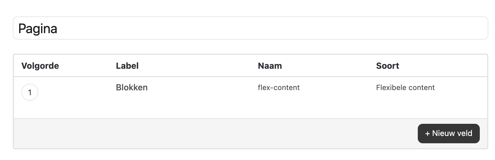
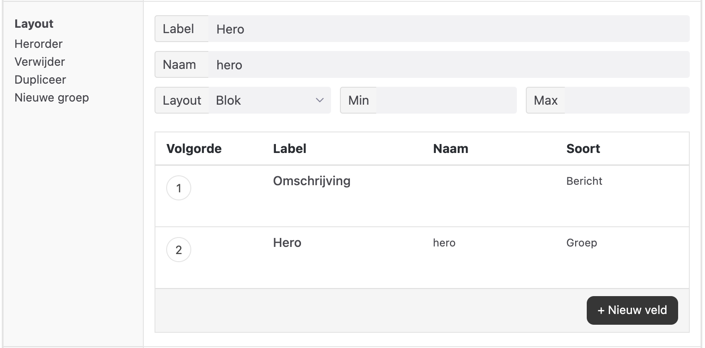

# Een blok aanmaken in Wordpress

1. Login op de wordpress omgeving
1. Navigeer naar 'Extra velden'->'Groepen'
1. Open de groep 'Pagina' en klik op de titel 'Blokken'

4. Het principe is als volgt: elk ___unieke___ blok op de website maak je hier aan als een unieke layout. Bijvoorbeeld: De hero van een pagina is op alle pagina's vrijwel gelijk. Je maakt dit blok dus 1x aan als Layout. Met alle velden er in die je in de Hero nodig hebt. Denk aan:
    - Achtergrond afbeelding
    - Titel
    - Subtitel
    - Call to Action (tekst en linkdoel)
    - Nog veel meer

5. Je maakt een nieuwe layout aan door in een bestaande layout op 'Nieuwe groep' te klikken en deze een naam te geven.