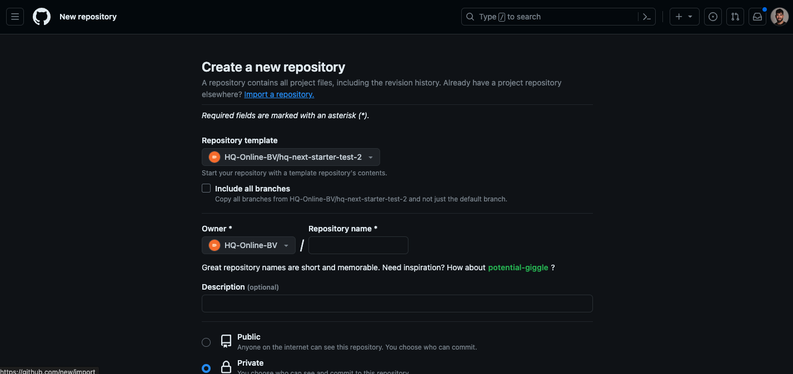

# Installatie


## Stap 1.
1. Maak een export van de [wordpress starter](https://headless.hq-beheer.nl) met All-in-one WP Export
1. Installeer dit op een nieuwe wordpress omgeving.

## Stap 2.
1. Maak een nieuwe repository aan in de HQ-Online-BV github organisatie met de hq-next-starter als **Repository template**.



2. Clone deze repository naar je eigen laptop.

## Stap 3.
1. Open de repository in je favoriete Editor
1. Open de repository folder in de terminal 
1. Voer `npm install` uit in de terminal
1. Maak een `.env.development` bestand aan met deze waarden (deze waarden vind je in de ReadMe van de starter op github): 
```.env copy filename=".env.development"
NEXT_PUBLIC_GF_KEY=ck_XXXXXXXXXXXXXXXXXX
NEXT_PUBLIC_GF_SECRET=cs_XXXXXXXXXXXXXXXXXX
NEXT_PUBLIC_GF_ENDPOINT=BACKEND_URL/wp-json/gf/v2
NEXT_PUBLIC_ENDPOINT=BACKEND_URL
NEXT_PUBLIC_GOOGLE_KEY=''
NEXT_PUBLIC_WP_USER='hq-online'
NEXT_PUBLIC_USER_SECRET='XXXX XXXX XXXX XXXX XXXX'
NEXT_PUBLIC_FRONTEND_URL='WEBSITE_URL'
```
5. Voer `npm run dev` uit in de terminal
1. De installatie is afgerond! Je kan nu beginnen met het bouwen van de website!